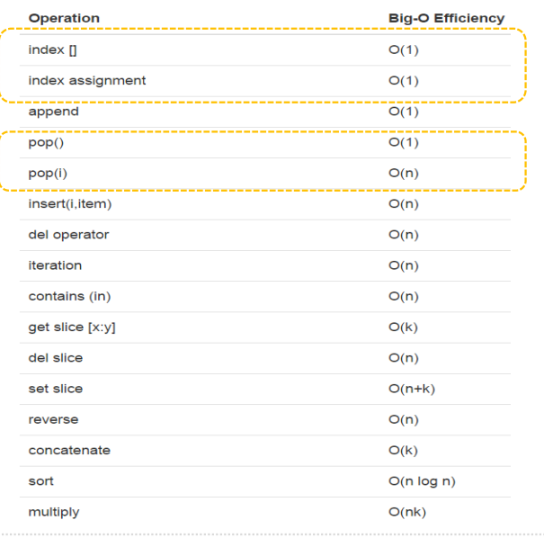
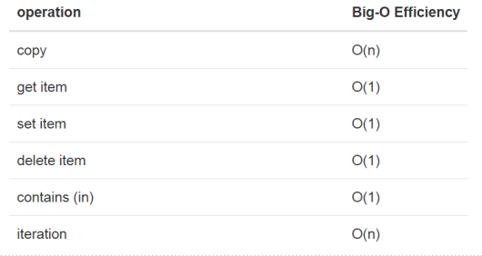

> 癸卯年 闰二月 初四
## Python 数据结构与算法分析(第二版) 笔记

### 第一章 笔记

P22

+ 当一个名字第一次出现在赋值语句的左边部分时,会创建对应的  Python变量,赋值语句将名字与值关联起来. 变量存放的是指向数据的**引用**,而不是数据本身.
+ 赋值语句 theSum  = 0 会创建变量 theSum, 并且令其保存指向数据对象 0 的引用.

P23 

+ 列表是零个或多个指向Python数据对象的引用的有序集合,
+ \*  重复运算结果 是序列中指向数据对象的引用的重复 
+ 字符串 是零个或多个字母 数字 其他符号的有序集合
+ 列表和字符串的区别是 列表可变 字符串不可变


### 进度

#### 第一个算法 欧几里得算法

辗转相除法求两数M,N的最大公约数.
1. 算法思想：
    + 输入 M,N
    + R = M mod N 
        + 若 R = 0 则最大公约数为 N
        + 若 R != 0 则 (M,N) = (N,R) 跳转到 R = M mod N 继续向下执行, 直到R = 0 为止.

#### 常见的大O数量级函数

|f(n)| 名称   |
| --- |------|
|1 | 常数   |
|Log(n)| 对数   |
|n| 线性   |
|n*Log(n)| 对数线性 |
|n²| 平方   |
|n³| 立方   |
|2^n| 指数   |

常见的有 
大O数量级表示法  所有上限中最小的哪个上线
大 Ω 表示法    所有的下限中 最大的下限
大 θ 表示法    上下线相同

#### 逐字检查
#### 大O 表示Python中各个数据类型的性能
1. list 
    + 
2. dict
    + 

#### Python 实现栈
```python
class Stack():
    """
    自定义实现栈
    """
    def __init__(self,list_item=None):
        self.items = list_item if list_item else []

    @classmethod
    def from_list(cls,list_item:list):
        return cls(list_item=list_item)

    def isEmpty(self):
        return self.items == []

    def push(self,item):
        self.items.append(item)

    def pop(self):
        return self.items.pop() if self.items else None

    def peek(self):
        return self.items[-1] if self.items else None

    def size(self):
        return len(self.items)
```
#### 利用栈 实现括号匹配

#### 利用栈 实现十进制转二进制 完成自动补0效果

#### 利用栈 实现中缀表达式转后缀

#### 利用栈 实现后缀表达式求值

#### Python 实现队列

#### Python 利用队列实现约瑟夫问题

#### Python 利用队列实现打印任务 (暂空)

#### Python 实现双端队列
#### Python 双端队列 实现 回文次 


